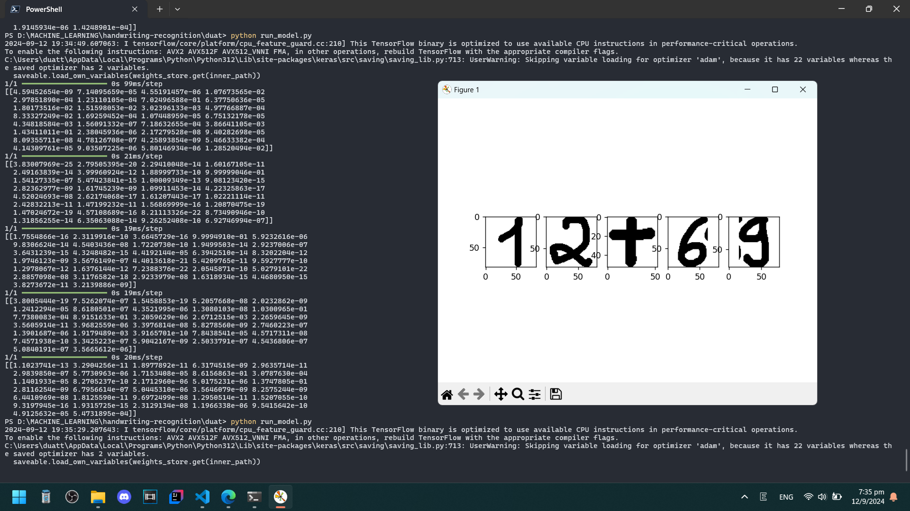

# Datasets
https://www.kaggle.com/datasets/xainano/handwrittenmathsymbols/data

The datasets originally contains 72 classes (math expressions), however, for the simplicity, I decided to reduce to 32 basic classes.

# Models
Main model: `math_expression_recognizer.keras`

Extra model (irrelevant): `digit_recognizer.keras` trained on MNIST datasets

Train the model: `train.py`

Run the model: `run_model.py`

